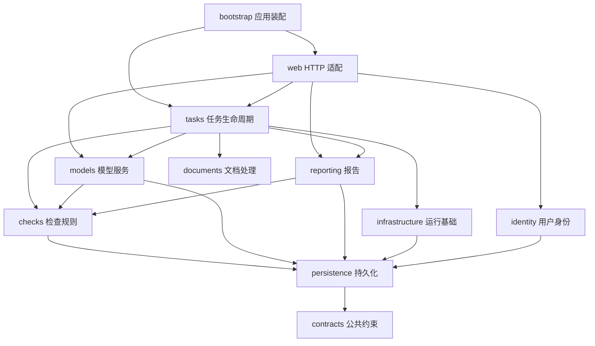

# 4+1 架构视图

本文描述文档智能门禁的场景、模块职责、依赖、进程与部署。HTTP 路由和 SQLite 结构以自动化兼容契约验证。

## 总览

```text
浏览器
  |
  v
run.py 主进程
  |
  +-- Uvicorn + Flask + a2wsgi 请求线程 x16
  |
  +-- 独立任务 supervisor
        |
        +-- 动态任务进程，机器上限 max_task_processes=4
              |
              +-- TaskRunner
                    |
                    +-- 任务内 ThreadPoolExecutor 检查项并发
                    +-- 文档解析、图片/视频处理、模型请求

所有进程和线程
  |
  +-- SQLite WAL：任务队列、状态、配置、报告
  +-- instance/：上传文件、提取产物、日志、监督器状态
  +-- 外部模型服务：OpenAI Chat Completions 兼容接口
```

## 场景视图（+1）

### 提交和执行任务

1. Web worker 接收上传、校验文件和模型配置。
   用户端和管理端共用检查项选择组件：单项默认选中，多项首次不预选，并按用户主体和任务类型在浏览器本地保存提交时的选择。恢复选择只匹配当前可用项，新增项需主动勾选；页面显示已选数量并支持全选、清空及提交前校验。
2. Web worker 将任务与提交时的配置快照写入 SQLite，任务状态设为 `queued`。
3. supervisor 在 SQLite 事务中认领任务，应用全局并发、单用户并发和机器级进程上限。
4. supervisor 通过 `app.bootstrap.task` 为每个已认领任务创建独立 Python 进程，保存任务 ID、租约令牌、PID 和进程创建时间，再通过标准输入授予执行许可。任务入口在应用初始化完成后报告业务就绪。
5. TaskRunner 在任务进程中读取任务快照，完成文档预处理并执行检查项。
6. TaskRunner 通过任务内线程池并发执行检查项，持续写入进度和中间结果。
7. TaskRunner 将任务状态更新为 `completed`、`partial`、`failed` 或 `canceled`。
8. Web worker 从 SQLite 读取任务状态和报告并返回页面或下载内容。

### 取消和恢复任务

- Web worker 将运行任务标记为 `canceling` 并写入 `cancel_requested`。
- TaskRunner 每秒通过 SQLite 读取取消标记和执行权变化；PDF 在页、表格及表格行边界检查取消，Excel 在行边界检查取消。
- supervisor 每 10 秒为存活任务更新 `lease_expires_at`，有效期为当前时间后的 90 秒。续约覆盖机器进程名额已满的状态。
- 受管理的任务在进程退出前持续占用机器、全局和用户并发名额；过期回收与队列认领排除这些任务。
- supervisor 观察到取消或执行权结束后给予 10 秒退出时间，再终止任务及其外部工具进程，3 秒后仍未退出则强制结束；确认退出后完成取消或恢复状态。
- supervisor 在 `instance/task-supervisor.json` 中原子保存进程身份，子进程收到启动许可后开始执行。新监督器先按 PID 和创建时间核验遗留进程，确认其退出后再恢复对应任务。
- supervisor 要求任务进程在创建后 60 秒内确认业务就绪；启动超时和就绪前异常退出在进程退出后写入明确失败原因。业务就绪后的长任务由租约持续管理。
- 状态文件原子替换遇到权限或文件共享占用错误时有限重试。执行许可依赖身份保存成功；进程终止和退出收尾尽力保存快照，写入失败时继续清理。
- supervisor 在停止服务时等待任务退出，随后终止剩余进程。未确认退出的进程保留身份记录供启动恢复使用。

### 管理并发配置

- `worker.max_task_processes` 定义机器级任务进程上限，默认值为 `4`。
- 管理页面的 `global_concurrency` 定义实际任务并发数，取值范围为 `1` 到 `max_task_processes`。
- supervisor 每轮从 SQLite 读取 `global_concurrency`，配置保存后立即影响新任务认领。
- `check_item_concurrency` 定义单个任务内部的检查项线程并发数。

## 逻辑视图

### 模块职责

| 模块 | 职责与入口 |
| --- | --- |
| `bootstrap` | `factory.create_app` 装配 Web 应用；`supervisor` 和 `task` 提供监督器及任务进程入口 |
| `contracts` | 任务类型、文件数量和输出条目限制等公共约束 |
| `infrastructure` | 本地配置、网络、日志、文件操作；`runtime` 创建进程应用上下文 |
| `persistence` | `connection` 管理连接，`schema` 管理初始化，`settings` 管理设置，`defaults` 管理默认检查项 |
| `identity` | 独立身份数据类型、IP/可信请求头身份解析与 SAML 适配 |
| `models` | 提供商与模型配置、模型发现、模型请求和流式协议 |
| `documents` | PDF、DOCX、表格和标记文本提取，图片提取、页面渲染与视频抽帧 |
| `checks` | 检查项目录、词表检查、链接校验、语种分析、报告证据约束 |
| `tasks` | 提交参数与结果、上传事务、调度认领、TaskRunner、进度、租约与文件生命周期 |
| `reporting` | 报告解析与规则过滤、人工复核、工作簿导入导出、统计缓存刷新 |
| `web` | 请求与响应适配、认证和权限编排、页面路由、模板和静态资源 |

### 服务与适配

Web 层将请求解析为 `TaskSubmission`，将提交服务返回的 `SubmissionResult` 转换为页面消息和跳转。模型服务显式接收用户主体，报告复核服务接收数据参数，工作簿服务返回文件内容。后台服务使用应用上下文访问数据库和日志。

用户任务、管理任务、模型管理、管理概览和系统设置分别注册路由。`web/__init__.py` 汇总注册过程；HTTP 路径、端点名称、认证、代理前缀和静态资源地址由兼容测试覆盖。

任务监督器直接调用 `tasks.runner.TaskRunner` 和 `reporting.statistics`。任务执行按文本、图片和视频分工，文档提取和检查规则具有独立模块入口。



完整依赖允许范围见 [开发与模块边界](development.md)。模块依赖保持单向，后台导入独立性由自动化测试验证。

### 持久化与查询

SQLite 使用 WAL，每个应用上下文持有独立连接，连接设置为外键约束开启、`synchronous=NORMAL`。数据库保存任务队列、配置、进度、报告、规则和复核统计；上传文件与提取产物保存在 `instance/`。

`persistence.schema` 统一维护索引定义。应用工厂在接收请求前完成表和索引初始化；新建表直接创建完整索引，已有表通过 `TODO(index-compat)` 区块补齐缺少的性能索引。补建及相关表的统计分析在初始化写事务中完成；索引完整时，索引检查只读取元数据。

- 用户列表使用类型、用户主体与创建时间组合索引；用户状态汇总使用类型、用户主体与状态覆盖索引；状态轮询按最多 100 个任务 ID 查询轻量状态和统计。
- 有活动任务时，列表和详情页每 10 秒局部更新。列表展示聚合执行阶段，详情页显示每项的等待、思考、输出和重试状态；检查项结束后隐藏标题状态。详情轮询通过版本标识复用已有报告，正文变化时更新对应结果区域，并保留展开状态与视频播放器。后台标签页、文本选择和控件编辑期间暂缓更新。
- 列表仅为多文档对照和跨语种任务读取分组元数据。轮询使用有效统计缓存，仅对已结束且统计过期的任务按主键检查报告存在性；报告写入通过触发器使缓存失效。
- 管理日期统计按支持的任务类型与日期范围使用现有索引。
- 模型配置按用户批量读取，模型选择按提供商主键与用户归属定位。
- 任务认领先通过状态与用户索引定位各用户的有限候选，再执行并发限制与全局排序。
- 报告汇总在 SQLite 内聚合统计字段，页面同步准备最近最多 20 个任务；监督器使用主键游标，每轮检查最多 512 个任务、刷新最多 100 个过期报告。
- 文件清理通过部分索引定位已结束且文件尚未清理的任务，按清理时间分批读取元数据。
- 删除任务使用任务 ID 索引清理误报命中记录；启用规则及版本统计使用类型与更新时间的部分索引。

详细查询边界与验证方法见 [性能与容量验证](performance.md)。数据库的表、字段、索引和触发器以结构契约约束。

### 文档处理

PDF 文本优先通过 PyMuPDF 提取，按页按需使用 pypdf 回退；候选向量边线触发表格识别。PDF 空格修正使用线性字符遍历，词条位置查找使用页面和工作表标记的二分索引。

PDF 表格复用页面已有字符边界建立文字存在性索引，仅对含文字候选的单元格执行原生文本回退，同页表格共用文本对象。图片及有效绘图按中心坐标建立有序索引，保留空单元格、合并关系和非文本内容判定。

`xlsx`、`xlsm` 使用单个只读工作簿，流式解析同时保留缓存值与公式。超链接按活动行范围和列范围定位，重叠范围保留声明顺序；行内空位保留，连续空白区域跳过。`xls` 使用 xlrd 按行提取。

图片检查的 PDF 文本提取跳过表格结构化，内嵌图片提取和页面截图按各自步骤执行；视频采样使用有界的两路 `ffmpeg` 抽帧，保留采样顺序和单帧失败回退。预处理结果持久化后供检查项和重试使用。

### 日志输出

应用、任务、模型和访问日志分别写入 `app.log`、`task.log`、`llm.log`、`access.log`，文件保留 INFO 及以上日志并独立轮转。控制台级别由 `logging.console_level` 设置，默认 WARNING，启动摘要和访问地址始终显示。Uvicorn 运行事件及异常写入 `app.log`，HTTP 请求由 Web 层记录访问日志。

各进程入口在应用依赖加载范围内记录未捕获异常。主进程和 Web worker 写入 `app.log`，调度器和任务进程写入 `task.log`；日志组件不可用时，标准库将诊断写入每进程独立的 `startup-<PID>.log`。进程异常同时输出到标准错误。

## 开发视图

```text
app/                              Python 命名空间包
  bootstrap/
    factory.py                    Web 应用装配
    server.py                     Uvicorn 启动与运行目录传递
    asgi.py                       Flask 工厂与 WSGI 请求线程池
    supervisor.py                 监督器进程入口
    task.py                       任务许可、初始化和业务就绪入口
    diagnostics.py                入口异常记录与标准库启动诊断
  contracts/
    task_types.py                 任务类型与文档数量约束
    limits.py                     输出数量约束
  infrastructure/
    config.py                     本地配置读写
    runtime.py                    配置、资源定位与进程应用上下文
    subprocesses.py               Python 解释器与子进程环境
    logging.py                    应用日志
    network.py                    网络配置与访问地址
    files.py                      文件系统操作
  persistence/
    connection.py                 SQLite 连接与时间
    schema.py                     表结构初始化
    settings.py                   设置、用户名与任务记录操作
    defaults.py                   默认检查项与配置同步
  identity/
    models.py                     用户身份数据
    service.py                    IP、可信请求头与会话身份
    saml.py                       SAML 协议适配
  models/
    service.py                    提供商与模型配置
    discovery.py                  模型发现
    client.py                     推理请求、流式响应与取消
  documents/
    extraction/                   PDF、DOCX、表格与标记文本解析
    images.py                     图片提取与页面渲染
    videos.py                     视频抽帧
  checks/
    catalog.py                    检查项目录与排序
    common_terms.py               常用词规则
    sensitive_terms.py            敏感词规则
    term_cache.py                 词表缓存
    term_locations.py             文档位置索引
    hyperlinks.py                 链接校验
    text_language.py              语种判断
    language_consistency.py       跨语种静态分析
    guardrails.py                 证据约束
  tasks/
    submission.py                 提交数据、验证、文件入库与任务事务
    files.py                      上传路径、任务文件与清理辅助
    supervisor.py                 调度、续约、恢复与任务进程管理
    activity.py                   轻量执行状态、单项取消信号与令牌隔离
    processes.py                  独立任务启动、就绪确认、快照与进程树退出
    runner.py                     TaskRunner 与文本检查编排
    runtime/
      preprocessing.py            文档、图片、视频与多文档预处理
      image_checks.py             图片检查编排
      video_checks.py             视频检查编排
      multimodal_protocol.py      多模态请求与结构化结果
      multimodal_common.py        批次、输入与摘要
      common.py                   配置和结果合并
      state.py                    进度、取消、租约与结果状态
      artifacts.py                产物统计与清理
  reporting/
    constants.py                  报告字段、状态和导出定义
    service.py                    报告解析、规则与复核
    excel.py                      工作簿生成与标注回填
    statistics.py                 统计聚合与后台刷新
  web/
    auth.py                       认证路由与权限
    user_tasks.py                 用户任务路由
    admin_tasks.py                管理任务路由
    models.py                     模型配置请求适配
    settings.py                   系统设置
    overview.py                   管理概览
    task_lists.py                 分页列表与状态响应
    task_actions.py               任务访问与操作响应
    task_media.py                 文件下载、媒体与视频响应
    submission.py                 上传请求与提交结果适配
    reports.py                    报告复核、导出与回填响应
    presentation.py               模板上下文与异常响应
    observability.py              访问日志与健康检查
    formatting.py                 Markdown 展示
    common.py                     请求辅助
    constants.py                  展示约定
    templates/                    Jinja 模板
    static/                       脚本与样式
run.py                            跨平台 Web 与监督器启动入口
scripts/benchmark_internal.py     临时环境 HTTP 并发压测
tests/                            行为、兼容、依赖和性能回归
```

所有 Python 源码归属模块目录。Web 工厂以明确资源路径加载 `web/templates/` 和 `web/static/`；后台进程只装配运行上下文。源码、模板和运行数据目录分别承担代码、展示和持久化职责。

## 进程视图

### 进程和线程角色

| 角色 | 默认数量 | 执行内容 |
| --- | ---: | --- |
| Web 服务（run.py 主进程） | 1 | Uvicorn 监听端口，使用 Flask 应用和事件循环处理 HTTP 请求 |
| a2wsgi 请求线程 | 每个 Web 进程 16 | 执行 Flask 请求 |
| 任务 supervisor | 1 | SQLite 队列调度、任务进程管理、续约和恢复 |
| supervisor 维护线程 | 1 | 文件清理和报告统计缓存刷新 |
| 任务进程 | 最多 4 | 一个独立模块进程执行一个任务 |
| 任务启动状态读取线程 | 每个任务进程 1 个，位于监督器 | 消费子进程输出，记录启动阶段并接收业务就绪信号 |
| 任务取消监测线程 | 每任务 1 | 读取取消标记与执行权变化 |
| 任务内检查线程 | 按 `check_item_concurrency` | 一个任务内并行执行检查项 |

任务 supervisor 由 `run.py` 通过 `app.bootstrap.supervisor` 创建为独立 Python 子进程，再启动 Uvicorn。Web worker 和监督器通过 `DOCUMENTCHECK_ROOT_DIR` 继承运行根目录，读取相同的配置和数据库。父进程通过标准输入管道通知监督器退出，监督器完成任务进程清理；进程存活使用 psutil 检查。任务进程通过 `subprocess.Popen` 直接启动 `app.bootstrap.task`，任务 ID 由命令行传递，租约令牌通过标准输入的许可消息传递，运行根目录由环境变量继承；每个进程自行创建应用对象和数据库连接。

Windows 虚拟环境中的监督器和任务进程通过基础解释器直接启动，使用 `__PYVENV_LAUNCHER__` 保留虚拟环境。统一的解释器选择函数保证父进程持有实际 Python 进程 PID；监督器使用该 PID 完成就绪、存活检查和退出处理。

Web 请求线程、任务进程和任务内检查线程都使用 Python 原生线程或进程。外部模型请求属于 I/O 操作，线程在等待网络响应时释放执行资源；文档解析和视频处理在独立任务进程中运行。

`server.web_workers` 默认为 1，Web 请求在启动进程中执行。显式设置大于 1 时，Uvicorn 创建相应数量的 Web 子进程并管理异常重启。

## 物理视图

### 单机部署

```text
客户端
  |
  v
可选反向代理（Nginx 等）
  |
  v
run.py（Uvicorn + Flask + a2wsgi）
  +-- task supervisor + task processes
  +-- instance/document_check.sqlite3
  +-- instance/uploads/
  +-- instance/extracted_images/
  +-- instance/logs/
  |
  v
外部模型服务
```

服务使用 Python 3.12 及以上版本，通过 `uv run python run.py` 在 Windows 和 Linux 启动 Uvicorn 与 a2wsgi。`config.yaml` 保存监听地址、端口、Web worker/线程数和任务进程上限。`uv.lock` 固定 Python 依赖版本。视频任务还需要系统提供 `ffmpeg` 和 `ffprobe`。

### 并发边界

- Windows 和 Linux 的 Web 请求线程容量均由 `web_workers × web_threads` 决定，默认 `1 × 16`；单进程配置直接在启动进程中提供 Web 服务。
- 任务并发容量由 `global_concurrency` 提供，并受 `max_task_processes` 约束。
- 单任务检查项并发由 `check_item_concurrency` 提供。
- SQLite 事务负责任务认领和状态转换，文件系统负责上传文件与提取产物。
- 模型服务连接数量还受任务数量、检查项并发和模型服务端限流共同约束。

## 设计约束

- Web worker 只处理 HTTP 请求和轻量数据库操作。
- supervisor 统一管理后台任务进程，系统同时运行一个 supervisor。
- 任务状态、取消信号、租约和中间结果写入 SQLite，跨进程可见。
- 任务进程完成或失败后立即清理任务表中的 API Key。
- `/health/live` 检查 Web 响应能力，`/health/ready` 同时检查 SQLite、运行目录和 supervisor 状态。

### 检查项状态与取消

任务执行状态使用 `settings` 中的 `task_activity:<task_id>` 键保存紧凑 JSON，包含执行令牌、任务阶段和检查项阶段。此记录只承载临时状态，不保存正文、思考内容或凭据。读写按主键定位，状态变化时写入，取消与完成在短事务内串行判定。任务正常收尾、监督器回收或删除时清理记录；执行令牌隔离不同运行，读取只接受当前活动任务的记录。

任务取消监测线程每秒读取一次整任务和检查项信号。文档、多文档对照及跨语种检查为每项维护独立取消事件，LLM 响应收到取消后关闭连接并停止重试；其他检查项保留执行。图片、视频保持合并请求，仅提供整任务取消。

LLM 适配层通过 `on_activity` 回调报告等待、思考、输出与重试阶段。`on_output` 独立传递模型返回的思考、正文和请求边界，供输出记录模块追加保存。展示逻辑以 Chat Completions 响应字段为依据，所有模型及自定义别名共用同一采集、保存和增量展示流程；输出展示与请求重试策略分别处理。开启思考时的纯思考上限为 64,000 段或 128,000 字符，关闭思考时为 64 段或 256 字符。请求超时约束连接和读取等待，任务没有统一的总执行时限；90 秒租约用于执行权与失联恢复。


### 模型输出查看

`tasks/model_output.py` 将响应按任务追加到生成产物目录的 `model-output-<task_id>.jsonl` 文件，共享缓冲和写锁，按 0.25 秒或 4,096 字符批量写入，请求结束时刷新尾部。合并请求关联多个检查项并保存一份文本；重试与补偿请求使用独立流标识。文件参与磁盘统计、保留期清理和任务删除，数据库表结构保持一致。

管理员与用户的 `GET /tasks/<id>/model-output?cursor=<字节位置>` 接口沿用任务访问权限，按主键检查归属和状态，每次从游标读取至多 64 KiB 的完整记录。该短请求独立于 10 秒报告刷新，展开时约每秒读取增量，追赶已有记录时连续分页，折叠、后台或读取完成时停止。浏览器按请求区分思考和正文，以文本节点追加内容，并保留输出区 DOM 和滚动位置。
